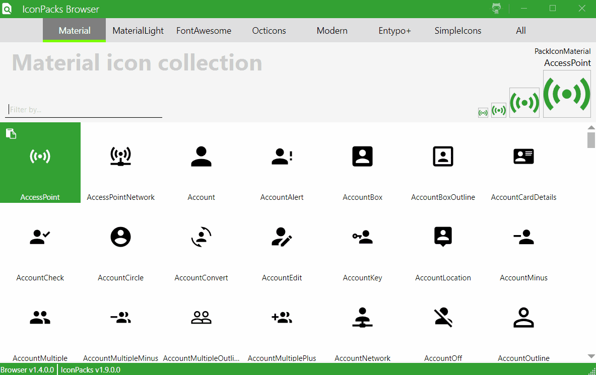

<div align="center">

  <h1>MahApps.Metro.IconPacks</h1>
  <a href="https://gitter.im/MahApps/MahApps.Metro.IconPacks">
	
  </a>
  <a href="https://twitter.com/punker76">
	
  </a>
  <a href="https://github.com/MahApps/MahApps.Metro.IconPacks/releases">
	
  </a>
  <a href="https://ci.appveyor.com/project/punker76/mahapps-metro-iconpacks/branch/master">
	
  </a>
  <a href="https://ci.appveyor.com/project/punker76/mahapps-metro-iconpacks/branch/dev">
	
  </a>
  <br />
  <a href="https://www.nuget.org/packages/MahApps.Metro.IconPacks/">
    
  </a>
  <a href="https://www.nuget.org/packages/MahApps.Metro.IconPacks.Material/">
    
  </a>
  <a href="https://www.nuget.org/packages/MahApps.Metro.IconPacks.MaterialLight/">
    
  </a>
  <a href="https://www.nuget.org/packages/MahApps.Metro.IconPacks.FontAwesome/">
    
  </a>
  <a href="https://www.nuget.org/packages/MahApps.Metro.IconPacks.Octicons/">
    
  </a>
  <a href="https://www.nuget.org/packages/MahApps.Metro.IconPacks.Modern/">
    
  </a>
  <a href="https://www.nuget.org/packages/MahApps.Metro.IconPacks.Entypo/">
    
  </a>
  <a href="https://www.nuget.org/packages/MahApps.Metro.IconPacks.SimpleIcons/">
    
  </a>
  <br />
  <br />

</div>

The `IconPacks` library contains controls to use awesome icons from

- [Material Design](https://materialdesignicons.com/) (v2.1.19 with 2119 icons)
- [Material Design Icons Light](https://github.com/Templarian/MaterialDesignLight) (v0.2.63 with 257 icons)
- [Font Awesome](https://fontawesome.com/) (v5.0.2 with 904 icons)
- [GitHub Octicons](https://octicons.github.com/) (v7.0.1 with 175 icons)
- [Modern](http://modernuiicons.com/) (1224 icons)
- [Entypo+](http://www.entypo.com/) (411 icons)
- [Simple Icons](https://simpleicons.org/) (v1.2.16 355 icons)

for `WPF` and `UWP` apps in a simple way.

It's not necessary to install [MahApps.Metro](https://github.com/MahApps/MahApps.Metro) (for WPF), but it makes your application nicer.



## Want to say thanks?

This framework is free and can be used for free, open source and commercial applications. It's tested and contributed by many people... So mainly hit the :star: button, that's all... thx :squirrel: (:dollar:, :euro:, :beer: or some other gifts are also being accepted...).

## Install

To install the IconPacks, run the following commands in the NuGet Package Manager Console or install it with the NuGet Package Manager extension.

- `MahApps.Metro.IconPacks` includes all Icons in one package [NuGet package](https://www.nuget.org/packages/MahApps.Metro.IconPacks/)
    ```bash
    PM> Install-Package MahApps.Metro.IconPacks
    ```
- `MahApps.Metro.IconPacks.Material` with this [NuGet package](https://www.nuget.org/packages/MahApps.Metro.IconPacks.Material/)
    ```bash
    PM> Install-Package MahApps.Metro.IconPacks.Material
    ```
- `MahApps.Metro.IconPacks.MaterialLight` with this [NuGet package](https://www.nuget.org/packages/MahApps.Metro.IconPacks.MaterialLight/)
    ```bash
    PM> Install-Package MahApps.Metro.IconPacks.MaterialLight
    ```
- `MahApps.Metro.IconPacks.FontAwesome` with this [NuGet package](https://www.nuget.org/packages/MahApps.Metro.IconPacks.FontAwesome/)
    ```bash
    PM> Install-Package MahApps.Metro.IconPacks.FontAwesome
    ```
- `MahApps.Metro.IconPacks.Octicons` with this [NuGet package](https://www.nuget.org/packages/MahApps.Metro.IconPacks.Octicons/)
    ```bash
    PM> Install-Package MahApps.Metro.IconPacks.Octicons
    ```
- `MahApps.Metro.IconPacks.Modern` with this [NuGet package](https://www.nuget.org/packages/MahApps.Metro.IconPacks.Modern/)
    ```bash
    PM> Install-Package MahApps.Metro.IconPacks.Modern
    ```
- `MahApps.Metro.IconPacks.Entypo` with this [NuGet package](https://www.nuget.org/packages/MahApps.Metro.IconPacks.Entypo/)
    ```bash
    PM> Install-Package MahApps.Metro.IconPacks.Entypo
    ```
- `MahApps.Metro.IconPacks.SimpleIcons` with this [NuGet package](https://www.nuget.org/packages/MahApps.Metro.IconPacks.SimpleIcons/)
    ```bash
    PM> Install-Package MahApps.Metro.IconPacks.SimpleIcons
    ```

## Usage

If you want all icons together then just install the `MahApps.Metro.IconPacks` NuGet package. You can also only install one of the icon packs if you don't need them all.

```xaml
<iconPacks:PackIconMaterial Kind="EmoticonCool" />
```

```xaml
<iconPacks:PackIconMaterialLight Kind="Heart" />
```

```xaml
<iconPacks:PackIconFontAwesome Kind="FontAwesomeBrands" />
```

```xaml
<iconPacks:PackIconOcticons Kind="MarkGithub" />
```

```xaml
<iconPacks:PackIconModern Kind="ThumbsUp" />
```

```xaml
<iconPacks:PackIconEntypo Kind="EmojiHappy" />
```

```xaml
<iconPacks:PackIconSimpleIcons Kind="StackOverflow" />
```

### Namespace

The `Xaml` namespace for all icon packs is:

```xaml
xmlns:iconPacks="http://metro.mahapps.com/winfx/xaml/iconpacks"
```

and for the `UWP` packages:

```xaml
xmlns:iconPacks="using:MahApps.Metro.IconPacks"
```

## IconPacks Browser

If you have no idea which icon you're supposed to take, then you can use the IconPacks Browser. You can search in every IconPacks and copy a raw `Xaml` code snippet to the clipboard.

You can download the latest version of the browser at the [release page](https://github.com/MahApps/MahApps.Metro.IconPacks/releases) or directly [here](https://github.com/MahApps/MahApps.Metro.IconPacks/releases/download/v1.9.0/IconPacks.Browser.NET45.v1.4.0.zip) (a zipped pre-compiled .NET 4.5 executable). 

## WPF Sample

```xaml
<Window x:Class="IconPacksTest.App"
        xmlns="http://schemas.microsoft.com/winfx/2006/xaml/presentation"
        xmlns:x="http://schemas.microsoft.com/winfx/2006/xaml"
        xmlns:iconPacks="http://metro.mahapps.com/winfx/xaml/iconpacks"
        Title="IconPacks" Height="300" Width="300">

   <Grid>
     <iconPacks:PackIconMaterial Kind="EmoticonCool" VerticalAlignment="Center" HorizontalAlignment="Center" />
   </Grid>

</Window>
```

## UWP Sample

```xaml
<Page x:Class="MahApps.Metro.IconPacks.Test.App.MainPage"
      xmlns="http://schemas.microsoft.com/winfx/2006/xaml/presentation"
      xmlns:x="http://schemas.microsoft.com/winfx/2006/xaml"
      xmlns:d="http://schemas.microsoft.com/expression/blend/2008"
      xmlns:mc="http://schemas.openxmlformats.org/markup-compatibility/2006"
      xmlns:iconPacks="using:MahApps.Metro.IconPacks"
      mc:Ignorable="d">

    <Grid Background="{ThemeResource ApplicationPageBackgroundThemeBrush}">
        <iconPacks:PackIconFontAwesome Width="32"
                                       Height="32"
                                       HorizontalAlignment="Center"
                                       VerticalAlignment="Center"
                                       Kind="AddressBookRegular" />
    </Grid>

</Page>
```

## MarkupExtension (only for WPF)

A faster way to get a `Button` (or any other `ContentControl`) with an Icon is to use the MarkupExtension(s).

If you want e.g. a Button with an Icon from the `PackIconFontAwesome` then you can do this one:

```xaml
<Button Content="{iconPacks:FontAwesome StarRegular}" />

<!-- or -->

<Button Content="{iconPacks:FontAwesome Kind=StarRegular}" />
```

It's also possible to change some properties of the icon itself like this:

```xaml
<Button Content="{iconPacks:FontAwesome SpinnerSolid, Width=32, Height=32, Spin=True}" />
```

It's also possible to use a general (generic) MarkupExtension:

```xaml
<Button Content="{iconPacks:PackIcon {x:Static iconPacks:PackIconMaterialKind.Cookie}, Width=32, Height=32}" />
```

### Breaking change 1.9.x -> 2.0

The MarkupExtension class names had to be renamed, cause the old ones doesn't worked well with the Visual Studio Designer (#29, #30).

**Before**

```xaml
<Button Content="{iconPacks:PackIconFontAwesome Kind=StarRegular}" />
```

**Now**

```xaml
<Button Content="{iconPacks:FontAwesome Kind=StarRegular}" />
```

## Properties

| Property | Description |
| --- | --- |
| `Kind` | Gets or sets the icon to display. Each IconPack has it's own icon type and an enumeration for it. |
| `Flip` | Gets or sets the flip orientation. Possible values are `Normal`, `Horizontal`, `Vertical` or `Both` from the enumeration type `PackIconFlipOrientation`. |
| `Rotation` | Gets or sets the rotation (angle) of the inner icon. Possible values are `0`-`360`. |
| `Spin` | Gets or sets a value indicating whether the inner icon is spinning (rotating) (`true` or `false`). |
| `SpinDuration` | Gets or sets the duration of the spinning animation (in seconds). This will also restart the spin animation and works only if `Spin` property is set to `true`. |
| `SpinEasingFunction` | Gets or sets the EasingFunction (`IEasingFunction`) of the spinning animation. This will also restart the spin animation and works only if `Spin` property is set to `true`. |
| `SpinAutoReverse` | Gets or sets the AutoReverse of the spinning animation. This will also restart the spin animation and works only if `Spin` property is set to `true`. |
| `Control.Properties` | All public properties of `Control`, e.g. `Width` and `Height` |

## Custom Styles

Sometimes it's necessary to change some properties for all used icon pack controls. All controls have styles which can be use for global changes or anything else.

For the `MahApps.Metro.IconPacks` you can e.g. create a custom resource dictionary (called here `CustomIconPacksStyles.xaml`) and add it to the `App.xaml` resource tag.

```xaml
<Application x:Class="IconPacksTest.App"
             xmlns="http://schemas.microsoft.com/winfx/2006/xaml/presentation"
             xmlns:x="http://schemas.microsoft.com/winfx/2006/xaml"
             StartupUri="MainWindow.xaml">
    <Application.Resources>
        <ResourceDictionary>
            <ResourceDictionary.MergedDictionaries>
                <!-- some other resources -->
                
                <!-- your custom icon resource -->
                <ResourceDictionary Source="pack://application:,,,/IconPacksTest;component/Resources/CustomIconPacksStyles.xaml" />

            </ResourceDictionary.MergedDictionaries>
        </ResourceDictionary>
    </Application.Resources>
</Application>
```

Here is the resource dictionary content for all IconPacks in this sample (for `CustomIconPacksStyles.xaml`).

```xaml
<ResourceDictionary xmlns="http://schemas.microsoft.com/winfx/2006/xaml/presentation"
                    xmlns:x="http://schemas.microsoft.com/winfx/2006/xaml"
                    xmlns:iconPacks="http://metro.mahapps.com/winfx/xaml/iconpacks">

    <ResourceDictionary.MergedDictionaries>
        <!-- reference all necessary original resource dictionaries -->
        <ResourceDictionary Source="pack://application:,,,/MahApps.Metro.IconPacks;component/Themes/PackIconMaterial.xaml" />
        <ResourceDictionary Source="pack://application:,,,/MahApps.Metro.IconPacks;component/Themes/PackIconMaterialLight.xaml" />
        <ResourceDictionary Source="pack://application:,,,/MahApps.Metro.IconPacks;component/Themes/PackIconFontAwesome.xaml" />
        <ResourceDictionary Source="pack://application:,,,/MahApps.Metro.IconPacks;component/Themes/PackIconOcticons.xaml" />
        <ResourceDictionary Source="pack://application:,,,/MahApps.Metro.IconPacks;component/Themes/PackIconModern.xaml" />
        <ResourceDictionary Source="pack://application:,,,/MahApps.Metro.IconPacks;component/Themes/PackIconEntypo.xaml" />
        <ResourceDictionary Source="pack://application:,,,/MahApps.Metro.IconPacks;component/Themes/PackIconSimpleIcons.xaml" />
    </ResourceDictionary.MergedDictionaries>

    <!-- now make some global changes for the icon pack controls without using new keys -->

    <Style TargetType="{x:Type iconPacks:PackIconMaterial}" BasedOn="{StaticResource MahApps.Metro.Styles.PackIconMaterial}">
        <Setter Property="Width" Value="32" />
        <Setter Property="Height" Value="32" />
    </Style>

    <Style TargetType="{x:Type iconPacks:PackIconMaterialLight}" BasedOn="{StaticResource MahApps.Metro.Styles.PackIconMaterialLight}">
        <Setter Property="Width" Value="28" />
        <Setter Property="Height" Value="28" />
    </Style>

    <Style TargetType="{x:Type iconPacks:PackIconFontAwesome}" BasedOn="{StaticResource MahApps.Metro.Styles.PackIconFontAwesome}">
        <Setter Property="Width" Value="24" />
        <Setter Property="Height" Value="24" />
    </Style>

    <Style TargetType="{x:Type iconPacks:PackIconOcticons}" BasedOn="{StaticResource MahApps.Metro.Styles.PackIconOcticons}">
        <Setter Property="Width" Value="48" />
        <Setter Property="Height" Value="48" />
    </Style>

    <Style TargetType="{x:Type iconPacks:PackIconModern}" BasedOn="{StaticResource MahApps.Metro.Styles.PackIconModern}">
        <Setter Property="HorizontalAlignment" Value="Center" />
    </Style>

    <Style TargetType="{x:Type iconPacks:PackIconEntypo}" BasedOn="{StaticResource MahApps.Metro.Styles.PackIconEntypo}">
        <Setter Property="VerticalAlignment" Value="Center" />
        <Setter Property="HorizontalAlignment" Value="Center" />
    </Style>

    <Style TargetType="{x:Type iconPacks:PackIconSimpleIcons}" BasedOn="{StaticResource MahApps.Metro.Styles.PackIconSimpleIcons}">
        <Setter Property="VerticalAlignment" Value="Center" />
        <Setter Property="HorizontalAlignment" Value="Center" />
    </Style>

</ResourceDictionary>
``` 
If you use the IconPack with all included icons you can also use this resource dictionary:

```xaml
<ResourceDictionary Source="pack://application:,,,/MahApps.Metro.IconPacks;component/Themes/IconPacks.xaml" />
```

## Strong naming

MahApps.Metro.IconPacks will not be strong-named.

Why?

Strong-named assemblies are only useful in some rare scenarios. If you need strong-named assembly then you can compile the source by yourself ore use the [Strong Namer](https://github.com/dsplaisted/strongnamer) from Daniel Plaisted @dsplaisted or [Strong-Name Signer](https://github.com/brutaldev/StrongNameSigner) from Werner van Deventer @brutaldev.

More informations about the reason of this decision can be found here:

- [Still Strong-Naming your Assemblies? You do know it’s 2016, right?](https://www.pedrolamas.com/2016/03/01/still-strong-naming-your-assemblies-you-do-know-its-2016-right/)
- [XAML Behaviors UWP Managed 1.1.0](https://www.pedrolamas.com/2016/02/23/xaml-behaviors-uwp-managed-1-1-0/)
- [Strong-Named Assemblies](https://docs.microsoft.com/en-us/dotnet/framework/app-domains/strong-named-assemblies)
