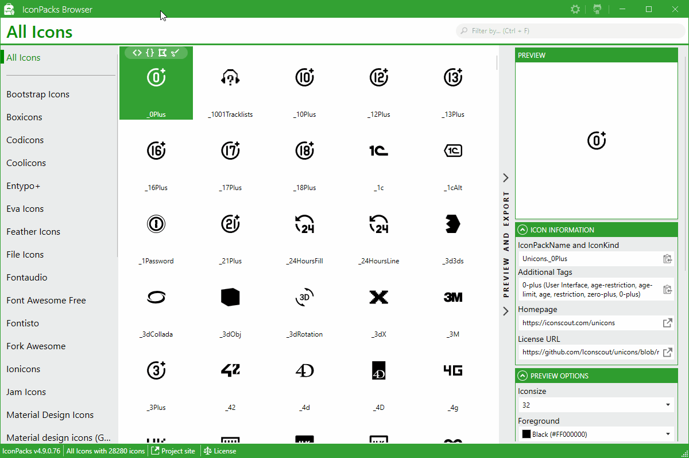

  
  <h1>MahApps.Metro IconPacks</h1>
  

    Awesome icon packs for <code>WPF</code> and <code>UWP</code> in one library
  

  

    Supporting .NET Framework 4.5+, .NET Core 3 (3.0 and 3.1), .NET 5 (on Windows) and UWP
  

  
  
  
   
  
  
   
   

This `IconPacks` library contains controls, markup extensions and converters to use these awesome icons in a simple way.

| Icon collection | Version | &#8721; | NuGet |
|---|--:|--:|:--|
| Complete IconPacks collection with all Icons in one package | | |  |
| [Bootstrap Icons](https://icons.getbootstrap.com/) | 1.6.1 | 1406 |  |
| [Boxicons](https://boxicons.com/) | 2.0.9 | 1525 |  |
| [Codicons](https://github.com/microsoft/vscode-codicons) | 0.0.25 | 383 |  |
| [Coolicons](https://github.com/krystonschwarze/coolicons) | 2.5.0 | 412 |  |
| [Entypo+](http://www.entypo.com/) | | 411 |  |
| [Eva Icons](https://github.com/akveo/eva-icons) | 1.1.3 | 490 |  |
| [Feather Icons](https://github.com/feathericons/feather) | 4.28.0 | 286 |  |
| [File Icons](https://github.com/file-icons/icons) | 2.1.43 | 876 |  |
| [Fontaudio](https://github.com/fefanto/fontaudio) | 1.1.0 | 155 |  |
| [Font Awesome Free](https://fontawesome.com/) | 5.15.4 | 1611 |  |
| [Fontisto](https://fontisto.com/) | 3.0.4 | 616 |  |
| [Fork Awesome](https://forkaweso.me/) | 1.2.0 | 794 |  |
| [Ionicons](https://ionicons.com/) | 4.6.4.1 | 696 |  |
| [Jam Icons](https://github.com/michaelampr/jam) | 3.1.0 | 940 |  |
| [Material Design Icons](https://materialdesignicons.com/) | 6.3.95 | 6395 |  |
| [Material Design Icons Light](https://github.com/Templarian/MaterialDesignLight) | 0.2.63 | 257 |  |
| [Material design icons (Google)](https://github.com/google/material-design-icons) | 3.0.1 | 932 |  |
| [Microns](https://github.com/stephenhutchings/microns) | 1.0.10 | 108 |  |
| [Modern UI Icons](https://github.com/Templarian/WindowsIcons) | | 1260 |  |
| [GitHub Octicons](https://octicons.github.com/) | 9.6.0 | 204 |  |
| [PICOL Icons](https://github.com/PicolSigns/Icons) | 1.1.0 | 549 |  |
| [Pixelarticons](https://pixelarticons.com/) | 1.4.0 | 460 |  |
| [Radix Icons](https://icons.modulz.app/) | 1.0.3 | 312 |  |
| [Remix Icon](https://remixicon.com/) | 2.5.0 | 2271 |  |
| [RPG Awesome](https://nagoshiashumari.github.io/Rpg-Awesome/) | 0.2.0 | 495 |  |
| [Simple Icons](https://simpleicons.org/) | 5.19.0 | 2064 |  |
| [Typicons](https://www.s-ings.com/typicons/) | 2.1.2 | 336 |  |
| [Unicons](https://github.com/Iconscout/unicons) | 2.1.11 | 1184 |  |
| [Vaadin Icons](https://vaadin.com/icons) | 4.3.2 | 636 |  |
| [Weather Icons](https://github.com/erikflowers/weather-icons) | 2.0.10 | 219 |  |
| [Zondicons](https://www.zondicons.com) | | 297 |  |

## Note

It's not necessary, but you can use these Icons together with [MahApps.Metro](https://github.com/MahApps/MahApps.Metro) which makes your `WPF` application nicer.

## Let's get started

- [Install](../../wiki/Install)
- [Wiki](../../wiki)

## Want to say thanks?

This framework is free and can be used for free, open source and commercial applications.

It's tested and contributed by many people... So mainly hit the :star: button, that's all... thx :squirrel: (:dollar:, :euro:, :beer: or some other gifts are also being accepted...).

Please give also a star to all available icon repositories.

[Become a sponsor](https://github.com/sponsors/punker76) and show your support to this open source project.

## IconPacks Browser

The Browser for all available Icon packages can be found [here](https://github.com/MahApps/IconPacks.Browser).

